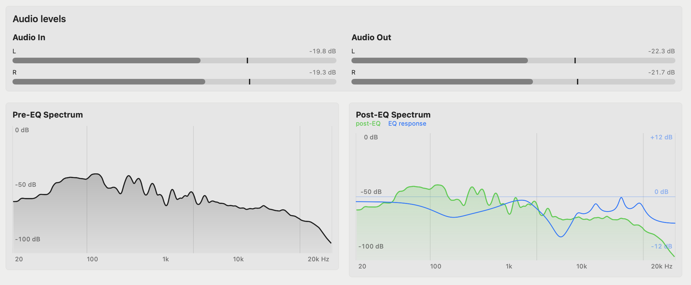

<p align="center">
  
</p>

<h1 align="center">CamiTune</h1>

<p align="center">
  A native lightweight macOS app for system-wide parametric EQ. Powered by CamillaDSP.
</p>

<p align="center">
  
  
  
  <a href="LICENSE"></a>
</p>

CamiTune gives macOS a proper **system-wide parametric equalizer** with an easy-to-use app interface. Each EQ band gives you direct control over its **frequency**, **gain**, **Q (bandwidth)**, filter type, and on/off state, with real-time pre-EQ and post-EQ response curve readings.

CamiTune can remember separate settings for each audio device and apply the correct profile automatically when you switch devices.

It’s also ultra-lightweight and designed for minimal system resource usage, with fast and efficient audio processing running quietly in the background without getting in your way.

## Functions

### Guided setup

Set up everything directly inside the app with **built-in drivers installation and verification** with simple **Install / Repair** and **Recheck** options. You can also enable **Launch at Login** so the app starts automatically when you sign in to macOS.


### Device profile

Create **profiles for every audio device**, each with its own sound, routing, sample rate, and activation rules. **Enable multiple profiles at the same time**, rename and organize them freely, and use **automatic EQ switching** to activate the right profile whenever your audio device or output changes.


### Live Spectrum
Monitor your sound in real time with **live input and output level meters**, **Pre-EQ and Post-EQ spectrum analyzers**, and a clear **EQ response overlay**. Instantly see how your equalizer changes the frequency balance and output of your audio as it plays.



### Parametric equalizer

An up to **20-band parametric equalizer** with real-time audio visualization and precise control over frequency, gain, Q, preamp, and filter types. See your EQ changes and sound levels update live as you tune. Easily import **Equalizer APO `.txt` presets** or paste Equalizer APO configuration text directly to instantly load and edit your settings.


### Run quietly in the background
Simply **close the app window to hide it in the menu bar** and it will continue running in the background. The icon shows your EQ status at a glance — **gray when EQ is inactive** and **yellow when EQ is active**. Reopen the app anytime from the menu bar or its **Dock icon**.


***

## Prerequisite

- macOS 13 Ventura or newer.

Intel Mac users can build the app from source, but the current ready-made GitHub download is for Apple silicon. Windows and Linux are not supported.

## Install CamiTune

### 1. Download the app

Open the repository's **Releases** page and download `CamiTune-v0.x.x-app.zip`.

### 2. Move it to Applications

Double-click the downloaded ZIP if your Mac did not extract it automatically. Then drag `CamiTune.app` into your Mac's **Applications** folder.

### 3. Open it for the first time

The current release is not signed with an Apple Developer ID or notarized, so macOS will probably block its first launch:

1. Try to open `CamiTune` from your Applications folder, then select **Done** when macOS blocks it.
2. Open **System Settings → Privacy & Security**.
3. Scroll down to **Security** and select **Open Anyway** beside CamiTune.
4. Confirm with your password or Touch ID, then select **Open**.

macOS saves the app as an exception, so you normally need to do this only once.

### 4. Install the audio components

1. In CamiTune, choose **Setup** in the sidebar.
2. Select **Install / Repair Everything**.
3. Enter your administrator password when macOS installs the bundled System Audio Bridge driver.
4. Restart your Mac if the app asks you to do so.
5. Reopen CamiTune after restarting.

### 5. Create your first sound profile

1. Select **Add Output Profile** at the bottom of the sidebar.
2. Choose audio devices you want to use.
3. Adjust the graphical equalizer, paste an Equalizer APO preset, or import a `.txt` preset.
4. Leave the sample rate at `48 kHz` unless you know your device needs another value.
5. Save your changes and activate the profile.

Start playback at a low volume. You should see movement in the level meters and live spectrum when everything is working.

### Which release file should I download?

| Download | Who it is for |
| --- | --- |
| `CamiTune-v0.x.x-app.zip` | Most users—extract it and move the app to Applications. |
| `CamiTune-v0.x.x-build-folder.zip` | Developers who want the complete generated build folder. |
| `SHA256SUMS` | Advanced users who want to verify downloaded files. |


## How it works

CamiTune safely sends your Mac's audio through the equalizer before it reaches your headphones or speakers:

```text
Audio from Mac apps
        ↓
Selected profile audio device
        ↓
CamiTune + CamillaDSP
  • applies the EQ
  • displays the live spectrum
        ↓
Headphones, speakers, or DAC
```

When you turn EQ off, CamiTune stops processing and returns audio to the physical output.

## Troubleshoot

- **The app will not open:** try once, then use **System Settings → Privacy & Security → Open Anyway**.
- **System Audio Bridge is missing after installation:** restart your Mac, then reopen CamiTune.
- **There is no sound:** deactivate the profile, confirm the physical output works normally, then reopen Setup and run **Install / Repair Everything**.
- **The spectrum does not move:** run **Recheck**, confirm System Audio Bridge is installed, and reactivate the profile. Confirm that the app reports it as active.
- **The duck menu-bar icon is hidden:** your menu bar may be full. Temporarily close another menu-bar app; when the duck appears, hold **Command** and drag it farther left.
- **The app uses lots of resources:** when the app window is opened, it needs to calculate the live spectrum graphs, simply close the window app and leave it on the menu bar.

***
## Build from source

Install Xcode or Xcode Command Line Tools with Swift 5.9 or newer, then run:

```bash
git clone https://github.com/Shuail135/CamiTune.git
cd CamiTune
./build-app.sh
open dist/CamiTune.app
```

The finished bundle is written to `dist/CamiTune.app`. You can also open `Package.swift` directly in Xcode for development.

## Current limitations

- The shipped processing profile is stereo; the driver transport is versioned and has capacity for up to 32 channels for future layouts.
- Releases are not yet Developer ID signed or notarized.
- CamiTune does not detect or disable unrelated system-EQ applications.
- Echo for sharing entire screen for people watching it cannot be eliminated, it can only be solved if the app have screen recording permission and I don't want it

***

## Third-party software

CamiTune builds CamillaDSP from its official upstream source with the included Core Audio UID patch and embeds that executable in the application. Setup installs this known-compatible build instead of downloading an unpatched release. The System Audio Bridge driver is also embedded and built from source in this repository.

- [CamillaDSP](https://github.com/HEnquist/camilladsp) — GPL-3.0 for the macOS build used here.
- System Audio Bridge is derived from [BlackHole](https://github.com/ExistentialAudio/BlackHole) — GPL-3.0.

See [THIRD_PARTY.md](THIRD_PARTY.md) for details. Review upstream terms again before changing how dependencies are acquired or distributed.

## Contributing

Issues and pull requests are welcome. When reporting an audio-routing problem, include your macOS version, Mac architecture, physical output device, selected sample rate, and the relevant CamiTune log without private information.

## License

Copyright © 2026 CamiTune contributors.

CamiTune is free software licensed under the [GNU General Public License v3.0 only](LICENSE). It is provided without warranty; see the license for complete terms.
