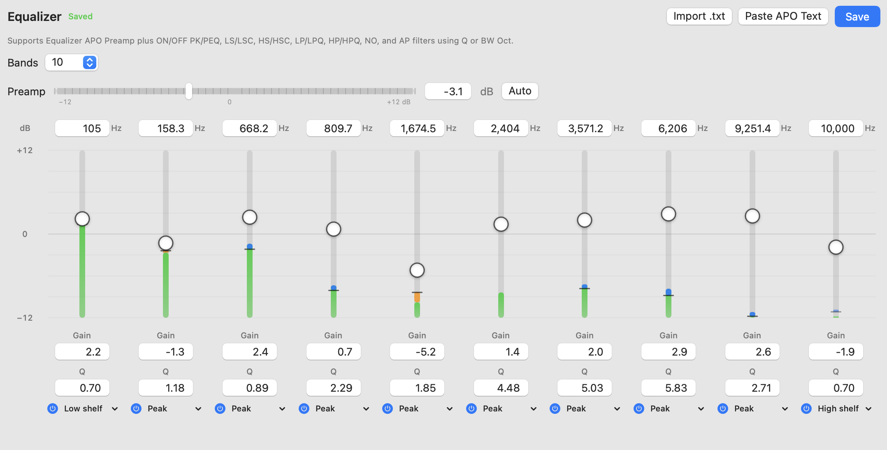
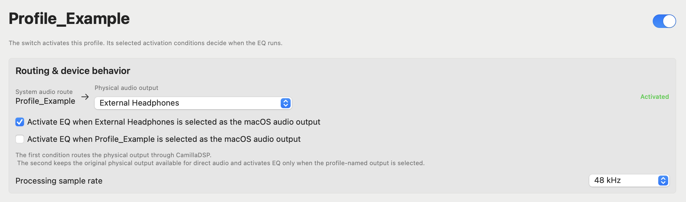
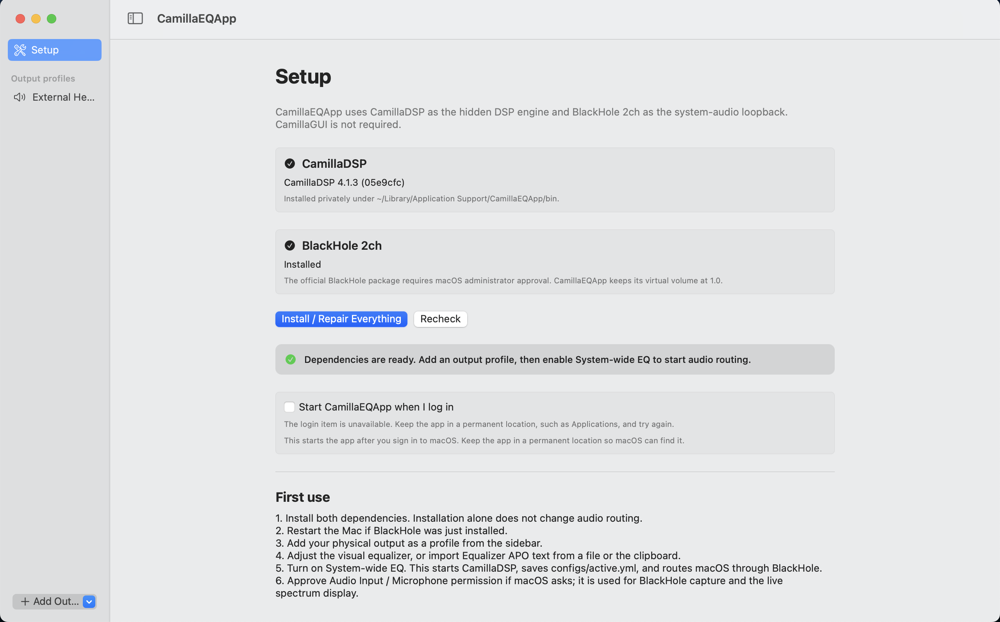

<p align="center">
  
</p>

<h1 align="center">CamillaEQApp</h1>

<p align="center">
  A native macOS app for system-wide parametric EQ with frequency, gain, and Q controls. Powered by CamillaDSP.
</p>

<p align="center">
  
  
  
  <a href="LICENSE"></a>
</p>

CamillaEQApp gives macOS a proper **system-wide parametric equalizer** with an easy-to-use app interface. Each EQ band gives you direct control over its **frequency**, **gain**, **Q (bandwidth)**, filter type, and on/off state, so you can make precise corrections instead of relying on a basic bass-and-treble control.

Your EQ applies to audio from the whole Mac. Choose your headphones, speakers, DAC, or audio interface; shape the sound visually or import an Equalizer APO preset; then turn on **System-wide EQ**. CamillaEQApp can remember separate settings for each output device and apply the correct profile automatically when you switch devices.

## Screenshots

### Parametric equalizer

Adjust frequency, gain, Q, and filter type while viewing the combined response curve.



### Device profile

Keep separate EQ and routing settings for each pair of headphones, speakers, DAC, or audio interface.



### Guided setup

Install and verify CamillaDSP and the bundled System Audio Bridge driver from inside the app.




## What you can do

- **Use precise parametric EQ:** directly adjust frequency, gain, Q, filter type, and enabled state for every band.
- **Adjust sound in an app interface:** control up to 20 EQ bands visually and see the resulting frequency-response curve.
- **Import existing settings:** paste or import common Equalizer APO headphone and speaker presets.
- **Save settings for each device:** keep different profiles for headphones, speakers, DACs, and audio interfaces.
- **Switch automatically:** apply the correct profile when its output device is selected or connected.
- **See what is playing:** view a live frequency spectrum and input/output level meters.
- **Run quietly in the background:** reopen the app from its duck icon in the menu bar.
- **Start at login:** optionally launch CamillaEQApp when you sign in to your Mac.
- **Set up required components:** install CamillaDSP and the bundled audio driver from the app's Setup page.

CamillaEQApp uses one active sound profile at a time. You can save as many profiles as you want, but your Mac's audio only passes through one EQ at once.

## How it works

CamillaEQApp safely sends your Mac's audio through the equalizer before it reaches your headphones or speakers:

```text
Audio from Mac apps
        ↓
Selected profile audio device
        ↓
CamillaEQApp + CamillaDSP
  • applies the EQ
  • displays the live spectrum
        ↓
Headphones, speakers, or DAC
```

When you turn EQ off, CamillaEQApp stops processing and returns audio to the physical output.

## Prerequisite

- macOS 13 Ventura or newer.

Intel Mac users can build the app from source, but the current ready-made GitHub download is for Apple silicon. Windows and Linux are not supported.

## Install CamillaEQApp

### 1. Download the app

Open the repository's **Releases** page and download `CamillaEQApp-v0.x.x-app.zip`.

### 2. Move it to Applications

Double-click the downloaded ZIP if your Mac did not extract it automatically. Then drag `CamillaEQApp.app` into your Mac's **Applications** folder.

### 3. Open it for the first time

The current release is not signed with an Apple Developer ID or notarized, so macOS will probably block its first launch:

1. Try to open `CamillaEQApp` from your Applications folder, then select **Done** when macOS blocks it.
2. Open **System Settings → Privacy & Security**.
3. Scroll down to **Security** and select **Open Anyway** beside CamillaEQApp.
4. Confirm with your password or Touch ID, then select **Open**.

macOS saves the app as an exception, so you normally need to do this only once.

### 4. Install the audio components

1. In CamillaEQApp, choose **Setup** in the sidebar.
2. Select **Install / Repair Everything**.
3. Enter your administrator password when macOS installs the bundled System Audio Bridge driver.
4. Restart your Mac if the app asks you to do so.
5. Reopen CamillaEQApp after restarting.

### 5. Create your first sound profile

1. Select **Add Output Profile** at the bottom of the sidebar.
2. Choose the headphones, speakers, DAC, or audio interface you want to use.
3. Adjust the graphical equalizer, paste an Equalizer APO preset, or import a `.txt` preset.
4. Leave the sample rate at `48 kHz` unless you know your device needs another value.
5. Save your changes and activate the profile.

Start playback at a low volume. You should see movement in the level meters and live spectrum when everything is working.

### Which release file should I download?

| Download | Who it is for |
| --- | --- |
| `CamillaEQApp-v0.x.x-app.zip` | Most users—extract it and move the app to Applications. |
| `CamillaEQApp-v0.x.x-build-folder.zip` | Developers who want the complete generated build folder. |
| `SHA256SUMS` | Advanced users who want to verify downloaded files. |

A Mac `.app` is actually a folder containing many files, so the release provides it inside a ZIP. Extract the ZIP before moving the app to Applications.

## Troubleshoot

- **The app will not open:** try once, then use **System Settings → Privacy & Security → Open Anyway**.
- **System Audio Bridge is missing after installation:** restart your Mac, then reopen CamillaEQApp.
- **System Audio Bridge is still listed, a renamed profile leaves a grey duplicate, or profile devices have no volume control:** open **Setup** and repair the audio driver. Driver `0.1.1` or newer is required for immediate profile-name/device-list refresh, hiding, and active-device volume control.
- **There is no sound:** deactivate the profile, confirm the physical output works normally, then reopen Setup and run **Install / Repair Everything**.
- **The spectrum does not move:** run **Validate Setup**, confirm System Audio Bridge is installed, and reactivate the profile. Confirm that the app reports it as active.
- **The duck menu-bar icon is hidden:** your menu bar may be full. Temporarily close another menu-bar app; when the duck appears, hold **Command** and drag it farther left.

# System Audio Bridge v0.1.1

System Audio Bridge is CamillaEQApp's output-only Core Audio driver. When an EQ
profile is activated, macOS sends system audio to a virtual output named after
that profile. The driver passes the audio to CamillaEQApp, CamillaDSP applies
the profile's filters, and the processed result is played through the physical
output selected in the profile.

Profile audio devices shown in the macOS output list act as selectors. Choosing
one tells CamillaEQApp which profile to activate. The temporary selector is then
replaced by the active bridge using the same profile name, which keeps the audio
route clear and preserves the normal macOS volume controls.

Only one profile processes system audio at a time. Other checked profiles can
remain available in the macOS output list, ready to be selected when needed.

## Equalizer APO syntax v1.0

Supported examples:

```text
Preamp: -5.0 dB
Filter 1: ON PK Fc 100 Hz Gain 2.0 dB Q 0.70
Filter 2: ON PEQ Fc 2500 Hz Gain -3.0 dB BW Oct 0.50
Filter 3: ON LS Fc 80 Hz Gain 1.5 dB Q 0.70
Filter 4: ON HS Fc 8000 Hz Gain -2.0 dB Q 0.70
Filter 5: ON HPQ Fc 25 Hz Q 0.70
Filter 6: ON NO Fc 8000 Hz Q 5.00
```

The graphical editor imports and exports `ON` and `OFF` filters. Presets using
`BW Oct` are converted to the equivalent Q value so they can be edited and
saved without changing the filter response. Supported graphical filter types
are `PK`/`PEQ`, `LS`/`LSC`, `HS`/`HSC`, `LP`/`LPQ`, `HP`/`HPQ`, `NO`, and `AP`.

`Device:` is recognized but ignored because device selection belongs to CamillaEQApp profiles. `Channel:` produces a warning because version 0.1.1 applies filters to both stereo channels.

The complete Equalizer APO language is not supported. This release does not claim support for `Include`, `GraphicEQ`, convolution, conditional expressions, processing stages, or arbitrary channel routing.

## Build from source

Install Xcode or Xcode Command Line Tools with Swift 5.9 or newer, then run:

```bash
git clone YOUR_REPOSITORY_URL
cd CamillaEQApp
./build-app.sh
open dist/CamillaEQApp.app
```

The finished bundle is written to `dist/CamillaEQApp.app`. You can also open `Package.swift` directly in Xcode for development.

## Current limitations

- The shipped processing profile is stereo; the driver transport is versioned and has capacity for up to 32 channels for future layouts.
- Releases are not yet Developer ID signed or notarized.
- CamillaEQApp does not detect or disable unrelated system-EQ applications.

## Roadmap

- Output Group.
- Input-device (microphone) EQ.
- Separate L/R EQ.
- Per-channel Equalizer APO `Channel:` support.
- Profile import and export.
- Simpler equalizer controls (bass, mids, and treble).
- Menu-bar quick controls.
- 5.1 and 7.1 processing.
- Individual app volume control.
- Dynamic Loudness
- Clipping protection
- Headphone Crossfeed

## Third-party software

CamillaEQApp downloads CamillaDSP from its official upstream location during setup. The System Audio Bridge driver is embedded in the application and built from the source in this repository.

- [CamillaDSP](https://github.com/HEnquist/camilladsp) — GPL-3.0 or MPL-2.0 for the macOS build used here.
- System Audio Bridge is derived from [BlackHole](https://github.com/ExistentialAudio/BlackHole) — GPL-3.0.

See [THIRD_PARTY.md](THIRD_PARTY.md) for details. Review upstream terms again before changing how dependencies are acquired or distributed.

## Contributing

Issues and pull requests are welcome. When reporting an audio-routing problem, include your macOS version, Mac architecture, physical output device, selected sample rate, and the relevant CamillaEQApp log without private information.

## License

Copyright © 2026 CamillaEQApp contributors.

CamillaEQApp is free software licensed under the [GNU General Public License v3.0 only](LICENSE). It is provided without warranty; see the license for complete terms.
